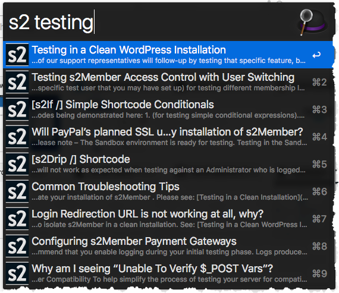
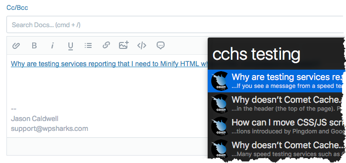
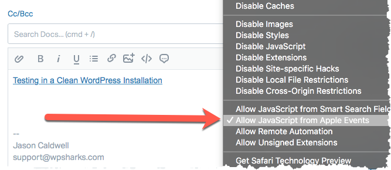
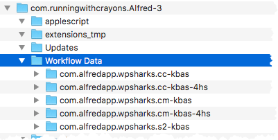

## [Alfred](http://www.alfredapp.com/) Workflows

Quick KB article suggestions.

### Installation Instructions

**See:** [Installing an Alfred Workflow](http://support.alfredapp.com/workflows:installing/)

- In Alfred, type: `s2` followed by a search query.
- Or, type: `cc` followed by a search query for Comet Cache.
- Or, type `cm` followed by a search query for Comment Mail.
- Choosing a result inserts a Markdown link into the current application.

### Using Help Scout Workflows

- In Alfred, type: `s2hs` followed by a search query.
- Or, type: `cchs` followed by a search query for Comet Cache.
- Or, type `cmhs` followed by a search query for Comment Mail.
- Choosing a result inserts an HTML link using JXA and contenteditable.

#### **Tip:** Safari Compatibility w/ Help Scout

All of our workflows have been tested mostly in Google Chrome. However, they should also work in Safari. If you need Safari compatibility, please note that our Help Scout workflows use JXA, and in order for JXA to work in Safari you will need to enable the following:

- First, close Chrome while testing in Safari. JXA looks for the current active application, and Chrome receives precedence. So while testing in Safari, for the best results, please close Chrome.
- Then, in Safari, see: `Develop →` **Allow JavaScript from Apple Events**. Please enable that setting so JXA via Alfred will function.

### Upgrading from a Previous Release

- Delete all existing s2, CC, and CM workflows.
- Import each of the new workflows.

#### Optional Cleanup

If you'd like to keep things clean, you can wipe all of the old cache directories from your system.

- See: `~/Library/Caches/com.runningwithcrayons.Alfred-3/Workflow Data`

  _It is safe to delete all of the cache directories related to these workflows, at any time you like. They should be easy for you to recognize by directory name and bundle ID._

